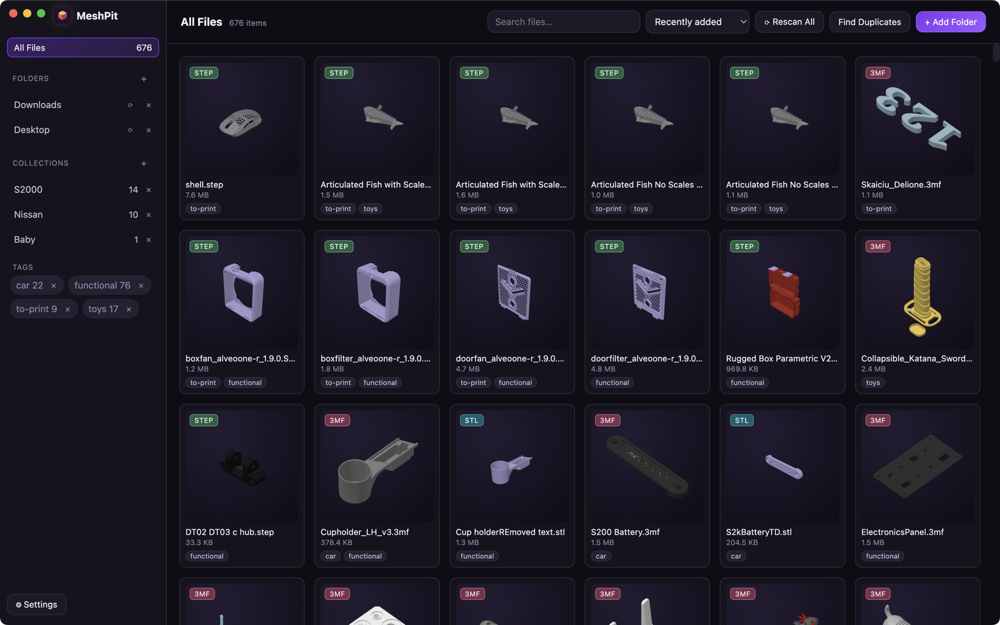
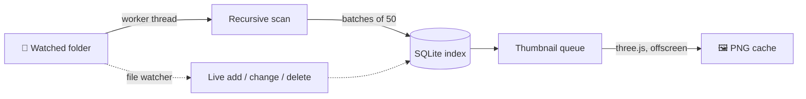
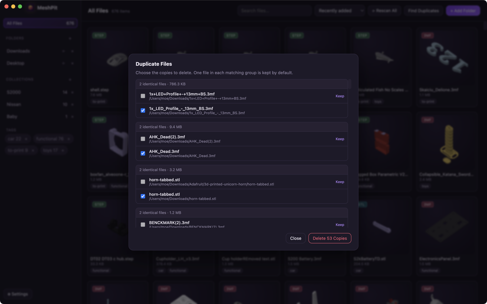
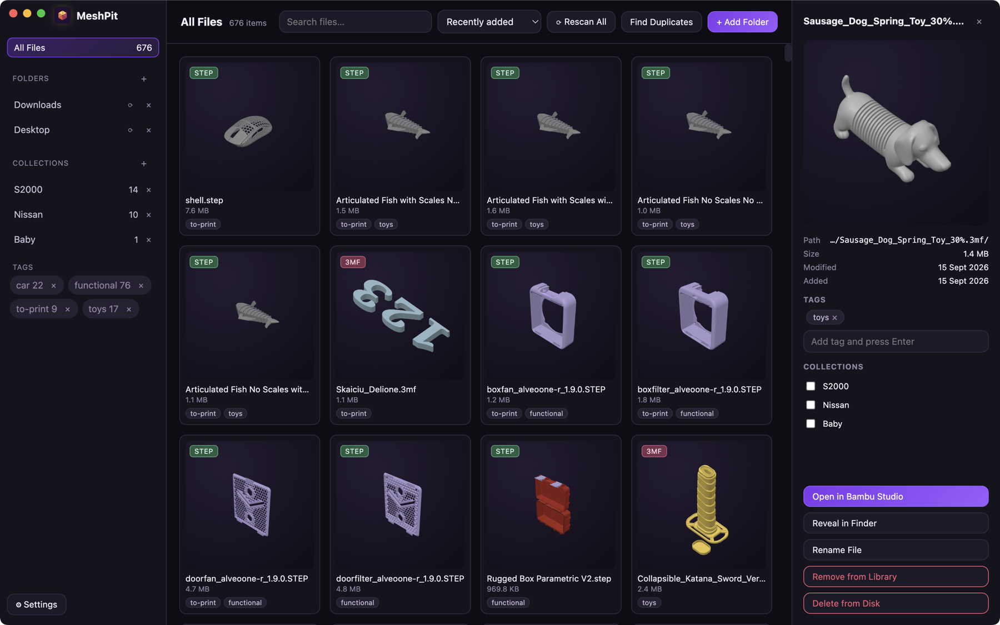
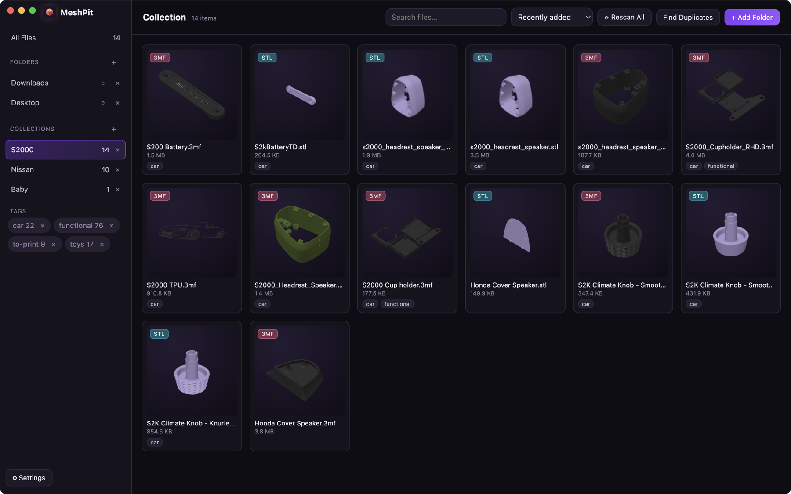

<p align="center">
  
</p>

<h1 align="center">MeshPit</h1>

<p align="center">
  <b>A local library for every 3D-printable file on your machine.</b><br/>
  Point it at a folder, walk away, and come back to a searchable, thumbnailed gallery.
</p>

<p align="center">
  
  
  
  
</p>

<p align="center">
  
</p>

---

## Why?

If you print, you hoard. A few hundred downloads later your models are scattered across
`Downloads`, half of them are called `files.stl`, and the only way to find the one you want is to
open them in a slicer one at a time.

MeshPit indexes your models **where they already live** — nothing is imported, copied or moved. It
walks the folders you choose, renders a preview of every model it finds, and puts the whole lot
behind a search box.

## Highlights

| | |
|---|---|
| 🗂️ **Nothing gets moved** | Your folder structure stays exactly as it is. MeshPit only keeps an index. |
| 🖼️ **Real previews** | Every STL, OBJ, 3MF and STEP file is rendered to a thumbnail — including the colour preview your slicer embedded in a 3MF. |
| 🔍 **Instant search** | Filter 10,000 files by name as you type, then sort by name, size, date added or date modified. |
| 🏷️ **Tags & collections** | Freeform tags for "articulated", "gift", "petg"; collections for projects you're actually building. |
| 🧬 **Duplicate finder** | Byte-for-byte duplicate detection via SHA-256, with a one-click cleanup. |
| 🖨️ **Straight to the slicer** | Double-click any model to open it in Bambu Studio (or your system default). |
| 🌙 **Stays out of the way** | Scanning runs on a low-priority background thread, so indexing 10,000 files doesn't cost you a frame. |

---

## How indexing works

Indexing is the part of MeshPit you should never have to think about, so here is what it's doing
while you don't.



### 1. Discovery — the background walk

When you add a folder, MeshPit spawns a **`worker_thread`** to walk it recursively. The walk never
touches the UI thread, and it deliberately plays nice:

- the thread asks the OS for the **lowest scheduling priority** it can get (POSIX),
- it **yields to the scheduler** every 25 directory entries,
- results are streamed back in **batches of 50** files, so the gallery fills in as the scan runs
  instead of appearing all at once at the end,
- **symlink loops** are broken by resolving real paths and tracking visited directories,
- hidden folders (`.git`, `.cache`, …) and `node_modules` are skipped.

Recognised extensions: **`.stl`**, **`.obj`**, **`.3mf`**, **`.step`**, **`.stp`**.

### 2. The index — one small SQLite file

Each file found becomes a row in a local SQLite database (WAL mode, so reads never block the scan).

| Recorded | Used for |
|---|---|
| Absolute path | Opening, revealing, and de-duplicating — it's the unique key |
| File name & extension | Search and the type badge on each card |
| Size in bytes | Sorting, and the first pass of duplicate detection |
| Modified time | "Recently modified" sort, and detecting edits |
| Date added | "Recently added" sort |
| Thumbnail path & status | The gallery grid |
| Tags & collections | Your own organisation, never touched by a rescan |

Rows are keyed on path, so **rescanning is idempotent** — a folder you've scanned a hundred times
produces the same index, and your tags and collections survive every one of them.

### 3. Thumbnails — rendered once, cached forever

Files with a `pending` thumbnail are queued and rendered **one at a time** in a hidden offscreen
Electron window, so the GPU work can't stutter the gallery you're scrolling:

- **STL / OBJ** — parsed with three.js, auto-framed, and rendered to a PNG.
- **3MF** — if your slicer embedded a plate preview (Bambu Studio, Orca, PrusaSlicer all do),
  MeshPit lifts that image straight out of the archive, which is why so many previews come out in
  full colour. If there isn't one, the mesh is rendered instead.
- **STEP / STP** — triangulated through OpenCascade (`occt-import-js`, WASM), preserving per-solid
  colours.

Renders are written to disk as PNGs and reused forever after. Thumbnail resolution is configurable
(160px / 320px / 512px) in **Settings**.

### 4. Staying in sync

| Event | What MeshPit does |
|---|---|
| A file is added to a watched folder | Picked up live by the file watcher and indexed immediately |
| A file is modified | Size and mtime update, and its thumbnail is re-rendered |
| A file is deleted or moved away | Dropped from the index |
| A file has vanished since the last scan | Flagged as *missing* and hidden from the gallery — its tags and collections are kept, in case the drive comes back |
| You hit **Rescan All** | Every watched folder is re-walked from scratch |

### 5. Duplicate detection

`Find Duplicates` is a two-pass check, so it stays fast on large libraries:

1. **Group by size** in SQL — files with a unique byte count can't be duplicates, so they're never
   read from disk.
2. **Hash the survivors** with SHA-256 and group by digest, giving byte-for-byte certainty rather
   than a filename guess.

You get one group per set of identical files, with the first copy marked *Keep* and the rest
pre-ticked for deletion — so cleaning up 53 redundant copies is one click.

<p align="center">
  
</p>

---

## A look around

**Details panel** — preview, full path, size and dates, tags, collections, and one-click actions.

<p align="center">
  
</p>

**Collections** — group models by project; a file can live in as many as you like.

<p align="center">
  
</p>

---

## Getting started

```bash
npm install
npm run dev        # run in development
npm run build      # production build → out/
npm run dist:mac   # package a .dmg   (also: dist:win, dist:linux)
```

Then:

1. **+ Add Folder** — pick a directory. The first scan starts immediately and thumbnails fill in
   behind it.
2. **Settings** — point MeshPit at your Bambu Studio install to enable one-click opening. Without
   it, models open in whatever your OS uses by default.
3. Print something.

## Keyboard shortcuts

| Shortcut | Action |
|---|---|
| <kbd>⌘</kbd>/<kbd>Ctrl</kbd> + <kbd>F</kbd> | Jump to search |
| <kbd>⌘</kbd>/<kbd>Ctrl</kbd> + <kbd>↑↓←→</kbd> | Move and extend the selection |
| <kbd>Shift</kbd> + click | Select a range |
| <kbd>⌘</kbd>/<kbd>Ctrl</kbd> + click | Add or remove one file from the selection |
| Double-click | Open in Bambu Studio |
| <kbd>⌫</kbd> | Remove the selection from the library (files stay on disk) |
| <kbd>⌘</kbd>/<kbd>Ctrl</kbd> + <kbd>⌫</kbd> | Delete the selection from disk (with a confirmation) |
| <kbd>⌘</kbd>/<kbd>Ctrl</kbd> + <kbd>R</kbd> | Rename the selected file on disk |

## Where your data lives

Your models are never touched. MeshPit's own state is a single database plus a thumbnail cache:

| Platform | Location |
|---|---|
| macOS | `~/Library/Application Support/MeshPit/` |
| Windows | `%APPDATA%\MeshPit\` |
| Linux | `~/.config/MeshPit/` |

Delete that folder and you're back to a clean install — your files stay exactly where they were.

## Built with

- **Electron** + `electron-vite` + **React** + **TypeScript**
- **better-sqlite3** — the local index
- **three.js** — offscreen thumbnail rendering
- **occt-import-js** — STEP triangulation
- **chokidar** + Node `worker_threads` — live watching and background scanning


## CAVEATS

Since I dont have an apple developer account you can run the following command on your command line to open the application: 
```
xattr -dr com.apple.quarantine /Applications/MeshPit.app 
```
